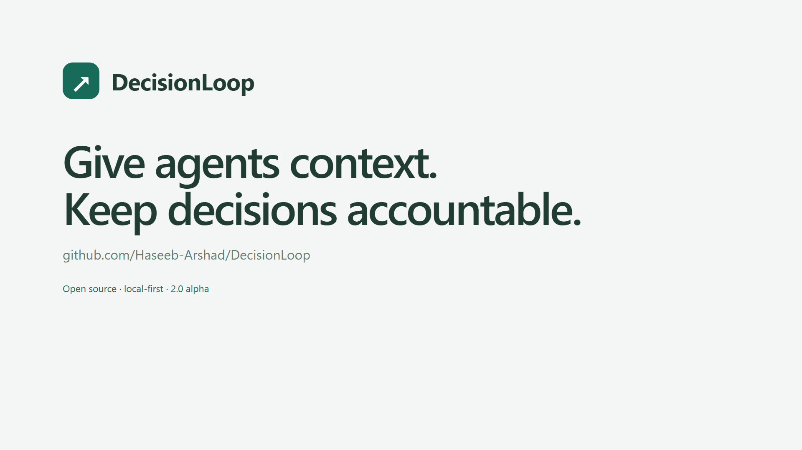
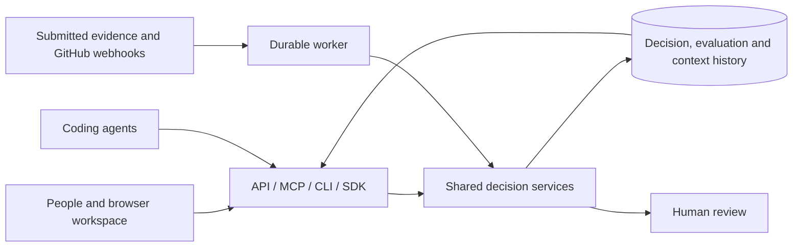

# DecisionLoop

### Give agents the reasoning behind your code.

DecisionLoop is shared decision memory for people and coding agents. It records what you chose, why you chose it, which alternatives you rejected, and what needs to remain true for the choice to make sense. Before an agent changes a system, it can retrieve the decisions that govern the work. When new evidence contradicts a recorded assumption, DecisionLoop flags the affected decision for review.

**The agent can change. The reasoning should stay.**

[Watch the 36-second demo](public/demo/decisionloop.mp4) · [Get started](#run-it-locally) · [Connect an agent](docs/v2/agents.md) · [Deployment](docs/deployment.md)

[](public/demo/decisionloop.mp4)

## The problem: an agent sees the code, but misses the tradeoff

As more implementation moves to agents, work crosses session boundaries, model changes, handoffs and repositories. The next agent can read the current implementation without knowing why it exists. A rejected design can look attractive again. An old assumption can continue shaping the code after the requirement behind it has changed.

This creates a practical gap between **what the system does** and **why the team wanted it that way**. Repeating an entire conversation in every prompt is fragile. A static architecture note helps, but cannot check itself against new observations.

DecisionLoop makes the tradeoff explicit, attaches it to the resources it governs, and keeps the evidence behind a warning inspectable. It gives agents a useful starting point and gives people a place to reconsider the choice.

## One decision, across several agent sessions

Consider an authentication service:

1. **Record the choice.** Use Redis-backed sessions because customers need immediate revocation. Preserve the rejected JWT alternative, its rejection reason, and the condition that session lookup stays below 20 ms.
2. **Give the next agent context.** An agent working on `src/auth/session.ts` asks for context. It receives the governing choice, rationale, rejected alternatives, conditions, constraints and current warnings within a token budget.
3. **Notice a changed assumption.** A representative measurement reports 35 ms. DecisionLoop matches the observation to the recorded latency condition, checks the comparison deterministically and creates an at-risk warning when the evidence's authority supports it.
4. **Make a human judgment.** A person sees the source and explanation, then accepts or dismisses the conflict, reopens the choice, or supersedes it with an approved replacement. The history remains available to the next agent.

This workflow runs locally without an AI model. Qualitative statements can use a configured reasoning model; unavailable judgments are recorded instead of guessed.


## What you get

| Capability | Why it matters |
|---|---|
| Decisions with rationale and rejected alternatives | A fresh session can understand the tradeoff rather than repeat the debate |
| Retrieval by files, services, dependencies and intent | Context follows the work, with structural relevance before semantic similarity |
| Typed assumptions and evidence checking | Numbers, booleans, dates, versions and sets can be checked without a model |
| Authority-aware conflict handling | A weak observation can challenge a choice without silently replacing it |
| Human approvals and scoped agent credentials | Agents propose changes; people make decisions authoritative |
| Traceable context and evaluation history | Inspect which evidence produced a warning and what context an agent received |
| Human-configured GitHub workflow checks | Surface completed workflow receipts with their repository, commit and conclusion |
| Durable background processing | Queue evidence processing independently of browser requests |
| CLI, MCP, HTTP API, SDK and browser workspace | Use the same decision services from the tools your workflow already uses |

Workflow receipts are advisory evidence. A configured workflow is not proof that it ran, and DecisionLoop does not turn a passing test into an automatic decision or merge approval.

## Where it fits

- **Agent-assisted maintenance:** preserve the constraints behind an existing implementation before a new session refactors it.
- **Multi-agent handoffs:** share approved decisions across tools and sessions rather than depend on one agent's conversation memory.
- **Architecture changes:** revisit a database, queue, dependency or service choice when its original operating conditions change.
- **Engineering onboarding:** explain why the team rejected an apparently simpler alternative, with the relevant source and history.
- **Evidence-driven review:** turn changed requirements, measurements or incidents into reviewable questions about existing choices.

DecisionLoop supplies context and review evidence. Its controls protect changes made through its own services; an agent must be connected and use the returned context. It does not guarantee that an external agent obeys every instruction or that an unconnected tool cannot edit your code.

## Run it locally

Use Node.js 22 and npm. No cloud account or database installation is required for local mode.

```bash
git clone --branch decisionloop-2.0 https://github.com/Haseeb-Arshad/DecisionLoop.git
cd DecisionLoop
npm ci
npm run build
npm link
```

In the repository whose decisions you want to preserve:

```bash
decisionloop init
decisionloop serve --web
```

Open **http://127.0.0.1:4318/signup** to create the first local owner. The browser joins the workspace initialized by the CLI. Record a decision, add a typed condition, then submit matching evidence from the Evidence screen.

```bash
decisionloop context src/auth/session.ts --intent "Refactor authentication"
decisionloop check
decisionloop doctor
```

The server runs the UI, API, MCP and worker over one embedded database connection. Stop it before using commands that open that database directly. For multiple processes or a hosted environment, use PostgreSQL or CockroachDB and follow [the deployment guide](docs/deployment.md).

For a complete example, see [first decision, first contradiction](docs/v2/getting-started.md).

## Connect your agents

Give agents the scoped `local-agents` credential created by `init`, never the administrator credential. The MCP tool list and underlying services restrict human decision actions.

The intended agent loop is small:

```text
Before changing code → decisionloop_get_context(intent, resources)
After a meaningful choice → decisionloop_propose_decision(...)
When new facts arrive → decisionloop_add_evidence(...)
When a choice needs reversing → ask a person to review the proposal
```

[Connection templates and hooks](docs/v2/agents.md) cover Claude Code, Codex, Cursor and GitHub Copilot. Custom clients can use [the TypeScript SDK](packages/sdk/src/index.ts), `/api/v1`, or MCP over HTTP/stdio. Packages are consumed from this repository; a published npm distribution is not required by the local setup above.

## How it works


```mermaid
flowchart LR
  H[People and browser workspace] --> API[API / MCP / CLI / SDK]
  A[Coding agents] --> API
  API --> C[Shared decision services]
  E[Submitted evidence and GitHub webhooks] --> W[Durable worker]
  W --> C
  C --> S[(Decision, evaluation and context history)]
  C --> R[Human review]
  S --> API
```

The headless core handles decisions, assumptions, retrieval, policies and approvals. SQL storage supports an embedded PGlite database for local work, PostgreSQL with pgvector, and CockroachDB. Reasoning and embeddings are replaceable providers. The default local setup uses no reasoning model and offline lexical embeddings; lexical matching is vocabulary-based, not a claim of semantic model quality.

See [architecture](docs/architecture.md), [configuration](.env.example), [GitHub App setup](docs/v2/github-app.md) and [security](docs/security.md).

## Quality and current status

**2.0 alpha, with a working local browser and agent workflow.** The latest local validation passed 220 tests across 26 files, 24 offline evaluation cases, typecheck, lint and the production build. The isolated production smoke check covers authentication, evidence processing, multiple-conflict review, context retrieval and persistence after a process restart. The dependency audit reported zero vulnerabilities at that check.

```bash
npm run typecheck
npm run lint
npm test
npm run eval
npm run build
npm run verify:deployment
npm audit
```

The evaluation uses lexical embeddings and scripted semantic judgments. These results measure the included test scenarios, not live model accuracy or adoption in an arbitrary repository. See the [repair and verification report](docs/reviews/2026-09-30-remediation.md) and [dogfooding plan](docs/v2/dogfood.md).

Container deployment and optional model, S3 and GitHub App integrations require validation in the environment where you enable them. Real repository dogfooding, backup/restore proof and broader operational hardening remain follow-up work. The deployment defaults close hosted signup, share request budgets through SQL and expose worker health separately from database health.

## Demo film and contributing

The [36-second film](public/demo/decisionloop.mp4) uses the actual rebuilt workspace and animated explanatory panels with synthetic example data. Its editable [Remotion project](video/README.md) includes the storyboard, sound generator and frame-verification commands.

For changes, include the decision or failure case you are improving, relevant tests, and the checks above. Keep model-free operation and the boundary between agent proposals and human decisions intact.

[MIT license](LICENSE).
