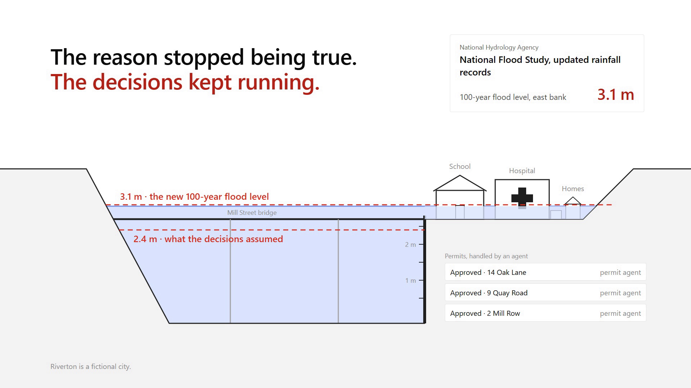
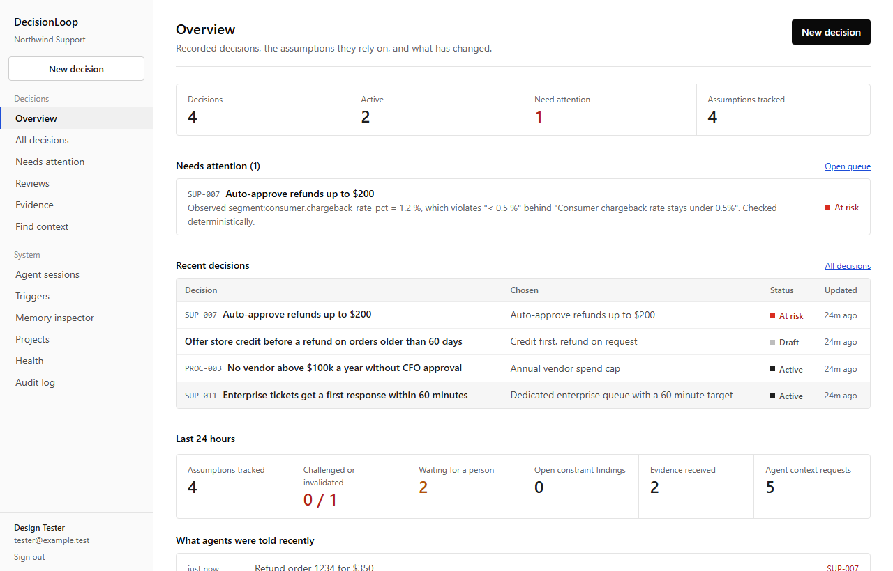
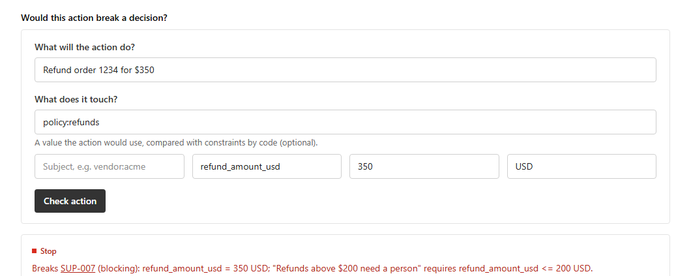
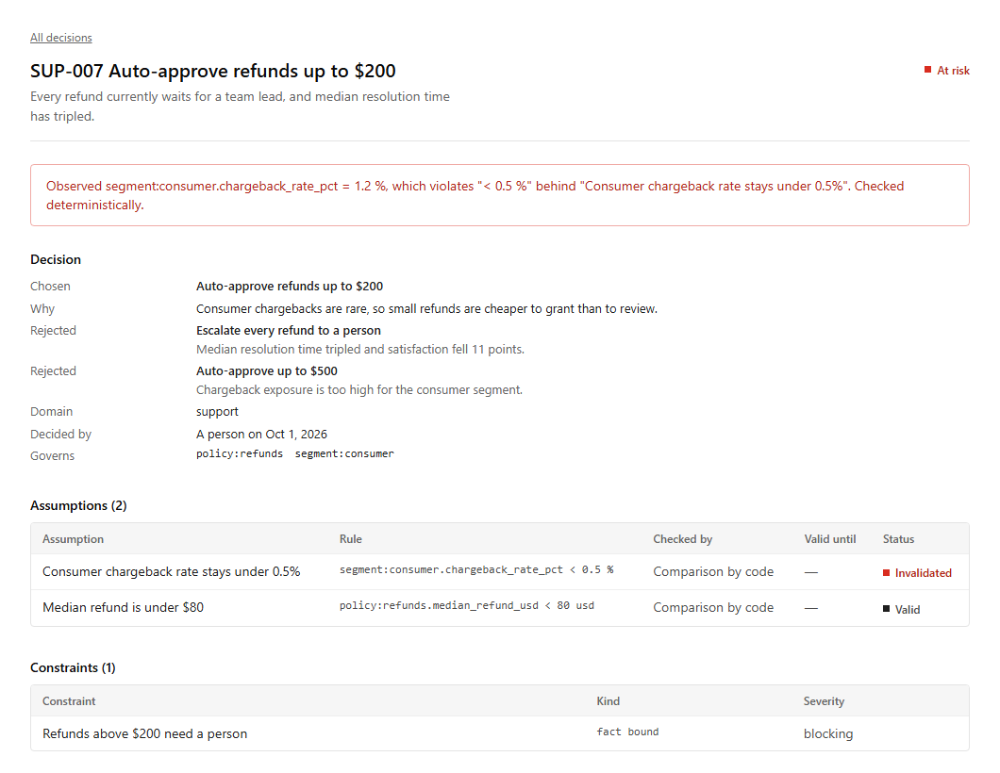

# DecisionLoop

**Decision memory for people and the agents that work for them.**

[](LICENSE)


DecisionLoop records **why** something was decided: the choice, the alternatives that were rejected, and the
assumptions that made it reasonable. Before an agent acts, it can ask what governs the work. When new
evidence contradicts an assumption, the decision is flagged **at risk** and a person reviews it.

It is not limited to code. The engine knows nothing about repositories; a coding agent asking *"what
governs `src/auth/`?"* and a support agent asking *"what governs this refund?"* are the same question.

[Quick start](#quick-start) · [One engine, any domain](#one-engine-any-domain) · [Connect an agent](#connect-an-agent) · [Domains guide](docs/v2/domains.md) · [Deployment](docs/deployment.md)

### The film: *The line on the wall* (1 min 43 s)

A city builds a school, keeps a hospital's generators on the ground floor and plans its evacuation route, all on
one assumption about a river's 100-year flood. Years later a national study says the assumption is wrong.
DecisionLoop finds every decision that relied on it, weighs the source, flags them for a person, and tells the
permit agent to stop before it approves a care home on the flood plain.

[](public/demo/the-line-on-the-wall.mp4)

**[▶ Watch the film](public/demo/the-line-on-the-wall.mp4)** (with sound and [captions](public/demo/the-line-on-the-wall.vtt)) ·
[720p](public/demo/the-line-on-the-wall-720p.mp4) · [how it was made](video-v2/README.md).
The city is fictional; every value on screen came from the real engine running that scenario.



## What it does

1. **Record.** A person commits a decision with its rationale, rejected alternatives, typed assumptions
   (numbers, booleans, dates, versions, sets, or plain statements) and the things it governs. Agents can
   only *propose*; nothing becomes authoritative without a person.
2. **Ask before acting.** An agent gets a short, sourced answer: the governing decision, why, what was
   rejected, what it assumes, and whether any of that is now in doubt.
3. **Notice change.** Evidence arrives from people, agents, documents and source systems. DecisionLoop
   finds the assumptions it bears on, compares values **by code**, weighs the source's authority, and only
   asks a model when code cannot decide.
4. **Keep the record.** Every check, the rule that produced it, and what each agent was told is stored and
   inspectable.

## One engine, any domain

| | Coding | Customer support | Procurement |
|---|---|---|---|
| A decision | Use Redis-backed sessions, not JWTs | Auto-approve refunds up to $200 | Select SignalForge as the analytics vendor |
| Assumption | Immediate revocation is required | Chargeback rate stays under 0.5% | Annual cost stays under $25,000 |
| Governs | `src/auth/**`, `npm:redis` | `policy:refunds`, `segment:consumer` | `vendor:signalforge` |
| Evidence that contradicts it | A merged PR removes `redis` | Finance reports 1.2% | A signed quote says $42,000 |
| The agent is warned | Before editing `src/auth/` | Before issuing a refund | Before renewing the contract |

The domain is a **profile**: a small JSON file (vocabulary, resource types, how much each source system is
trusted, how to read its payloads). Engineering is one profile and the default; with no profile configured
DecisionLoop behaves exactly as it always has, and a test pins the wording coding agents receive.

```bash
decisionloop init --profile support       # or sales, operations, or your own JSON file
```

Agents can also **dry-run an action** before it happens. The values the action would use are compared with
the decision's constraints by code:

```text
$ decisionloop act "Refund order 1234 for $350" --resource policy:refunds --fact '{"predicate":"refund_amount_usd","valueType":"NUMBER","value":350,"unit":"USD","statement":"Refund of $350"}'
STOP
STOP: this would break a blocking constraint. Do not proceed without a person's approval.
- Breaks SUP-007 [BLOCKING]: Refund of $350; "Refunds above $200 need a person" requires refund_amount_usd <= 200 USD.
- SUP-007 is AT RISK: the reasons behind it are in doubt. Confirm with a person before relying on it.
...
```



Details, the profile format and what is not built yet: **[docs/v2/domains.md](docs/v2/domains.md)**.

## Quick start

Requires Node 20.9+. No database to install: local mode embeds PostgreSQL (PGlite with pgvector).

```bash
git clone https://github.com/Haseeb-Arshad/DecisionLoop && cd DecisionLoop
npm install
npm run build
npm link                      # puts `decisionloop` on your PATH
```

In the folder you want it to know about (a code repository, or any folder):

```bash
decisionloop init                    # add --profile support for a non-coding domain
decisionloop serve --web             # API + MCP + worker + web UI on http://127.0.0.1:4318
```

Open `/signup` to create the first local account, then record a decision (JSON shape in
[docs/v2/getting-started.md](docs/v2/getting-started.md)):

```bash
decisionloop propose --commit --file adr-018.json
decisionloop context src/auth/session.ts        # what governs this?
decisionloop evidence add --statement "Security review: revocation is no longer required" \
  --fact '{"subject":"service:auth","predicate":"immediate_revocation_required","valueType":"BOOLEAN","value":false,"statement":"No longer required"}'
decisionloop decisions --at-risk                 # the decision is now flagged
```



## Connect an agent

Give agents the **agent** key (read and propose) from `.decisionloop/credentials.json`. With it the server does
not list the tools that commit, accept or supersede anything, and the services refuse them underneath anyway.

| Client | Setup |
|---|---|
| Claude Code | [MCP config](integrations/claude-code/.mcp.json) and optional [hooks](integrations/claude-code/settings.json) |
| Claude Desktop | [`claude_desktop_config.json`](integrations/claude-desktop/claude_desktop_config.json) |
| Codex, Copilot (VS Code), Cursor | [`integrations/`](integrations) |
| Your own agent | [`@decisionloop/sdk`](packages/sdk/src/index.ts): [example](integrations/custom-agent/check-before-acting.ts) |
| Source systems (ERP, billing, helpdesk) | `POST /api/v1/events` with a key bound to one source: [guide](docs/v2/domains.md#feeding-it-from-source-systems) |
| Anything else | MCP over HTTP (`/mcp`) or stdio (`decisionloop mcp`), or the HTTP API (`/api/v1`) |

Full guide: [docs/v2/agents.md](docs/v2/agents.md).

## How it works

```text
   Web UI              Agents and source systems (MCP, SDK, HTTP)              GitHub App
      │                                   │                                        │
      ▼                                   ▼                                        ▼
   ┌─────────────── HTTP API /api/v1 · MCP /mcp · CLI · SDK ──────────────────────────┐
   │                      DecisionLoopOperations (one contract)                        │
   └───────────────────────────────────────┬───────────────────────────────────────────┘
                                           ▼
   ┌──────────────────────────────── @decisionloop/core ─────────────────────────────────┐
   │ decisions · typed assumptions · evaluators · policies · trigger engine · approvals   │
   │ context · action checks · blast radius · domain profiles (engineering is one)         │
   └──────────────┬──────────────────────────┬───────────────────────────┬────────────────┘
                  ▼                          ▼                           ▼
        storage-sql (CockroachDB,     providers (Bedrock,        durable jobs + worker
        PostgreSQL + pgvector, PGlite) OpenAI-compatible, offline)  (retries, dead letter)
```

- **Headless core.** No framework, database or model SDK imports in `@decisionloop/core`; a test enforces it.
- **Deterministic before semantic.** Numbers, booleans, dates, versions and sets are compared by code.
  Without a model, qualitative checks are recorded as *unavailable*, never guessed.
- **Evidence has authority.** A signed contract outranks a blog post; an agent's own report can challenge an
  assumption but never invalidate it. Policies can only make outcomes more conservative.
- **Transactional provenance.** A state change commits in the same transaction as the record explaining it.
- **Tenant isolation** is enforced in every query and covered by the evaluation.

## Compared with agent memory and RAG

| | Chat memory, RAG | DecisionLoop |
|---|---|---|
| Unit of memory | Text chunks | Decisions: options, rejection reasons, typed assumptions, constraints, governed resources |
| Relevance | Embedding similarity | What the decision governs first, similarity second |
| Staleness | Silent | Assumptions are checked against every new piece of evidence |
| Contradictions | Not handled | Deterministic comparison, authority-weighted, policy-driven |
| Who can change history | Whoever writes | Agents propose, people approve, everything append-only |

## Configuration

| Variable | Purpose |
|---|---|
| `DATABASE_URL` | CockroachDB or PostgreSQL with pgvector. Unset means the embedded database (local mode) |
| `DECISIONLOOP_PRIMARY_DOMAIN`, `DECISIONLOOP_PROFILES_DIR` | Domain agents are addressed in; where profile JSON files live (set by `init --profile`) |
| `DECISIONLOOP_REASONING_PROVIDER` | `bedrock`, `openai` or `none` (default `bedrock` when `AWS_REGION` is set, else `none`) |
| `DECISIONLOOP_EMBEDDING_PROVIDER` | `bedrock`, `openai` or `lexical` (default `bedrock` when `AWS_REGION` is set, else offline `lexical`) |
| `OPENAI_BASE_URL`, `OPENAI_API_KEY`, `OPENAI_REASONING_MODEL`, `OPENAI_EMBEDDING_MODEL` | Any OpenAI-compatible endpoint; used only when selected |
| `GITHUB_WEBHOOK_SECRET`, `GITHUB_APP_ID`, `GITHUB_APP_PRIVATE_KEY` | GitHub integration |
| `SESSION_SECRET` | Web session signing (generated automatically by `serve --web` locally) |

Everything else: [.env.example](.env.example). Production on CockroachDB and Bedrock: [docs/deployment.md](docs/deployment.md).

## Quality

```bash
npm test             # unit and integration tests, against embedded PostgreSQL (or your DATABASE_URL)
npm run eval         # behavioural evaluation, written to evals/reports/latest.md
npm run typecheck && npm run lint && npm run build
```

The evaluation seeds a synthetic workspace spanning engineering, support and procurement and scores what the
system actually does: the right decision retrieved and ranked first, lookalikes not dominating, numeric and
qualitative contradictions, weak versus strong sources, superseded decisions, tenant isolation, agent
changes that do or only look like they violate a decision, and action checks. On that dataset: retrieval
recall 1.00, governing decision ranked first 1.00, conflict precision and recall 1.00, no false alerts, no
tenant leaks, action-check accuracy 1.00, about 120 tokens of context per request. These are results on a
**synthetic** dataset with a scripted stand-in for the model, not a claim about your data.

## Not done yet

- **No real-world use yet.** It has not run on production repositories or on real support, sales or
  procurement work. Acceptance and override rates can only come from that ([plan](docs/v2/dogfood.md)).
- **Qualitative statements need a model.** Without one they are flagged for a person. Model quality has not
  been measured on real data.
- **Learning is narrow.** Approved predicate aliases are learned; adjusting source authority from dismissed
  conflicts and inferring a decision's domain are not built.
- **One vocabulary per workspace.** Several domains can be loaded, but only the primary one sets how agents
  are addressed.
- **Embedded database is single-connection.** Run everything in one `decisionloop serve`, or use PostgreSQL or
  CockroachDB for several processes.
- **Packages are consumed from source**; publishing built packages to npm is not done.
- **GitHub integration** is advisory only and was tested against a fake GitHub API, not a live App.
- The older `/api/decisions`-style web routes still use the 1.x repository layer over the same tables.

## Documentation

- [Getting started](docs/v2/getting-started.md): first decision, first contradiction
- [Domains](docs/v2/domains.md): profiles, constraints, action checks, source events
- [Connecting agents](docs/v2/agents.md) and [GitHub App](docs/v2/github-app.md)
- [Audit and plan](docs/v2/00-audit-and-plan.md): how 2.0 was derived, schemas, MCP contracts
- [Deployment](docs/deployment.md), [security](docs/security.md), [architecture](docs/architecture.md), [memory model](docs/memory-model.md)
- [Dogfooding plan](docs/v2/dogfood.md) · [the original hackathon README](docs/v1-README.md)

## License

[MIT](LICENSE)
