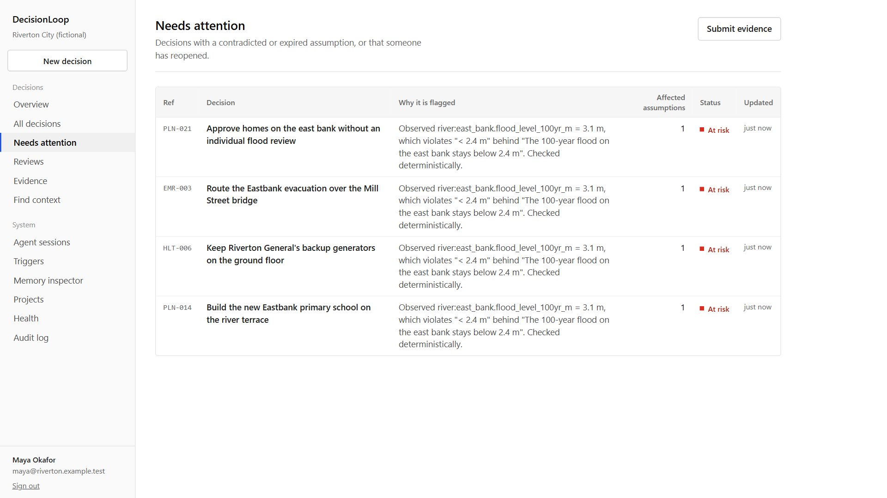
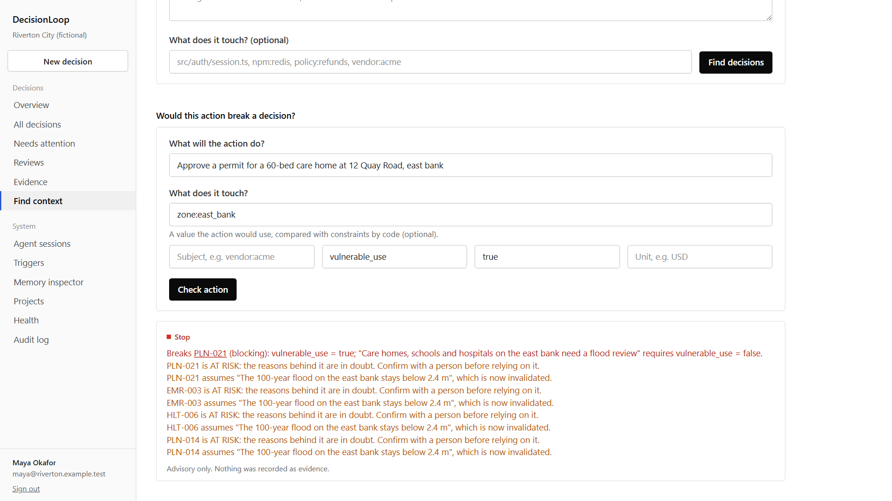
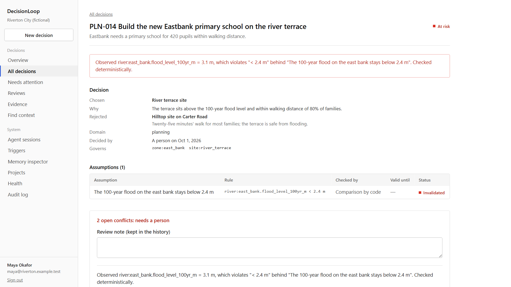

# DecisionLoop

**Decision memory for people and the agents that work for them.**

[](LICENSE)


DecisionLoop records **why** something was decided: the choice, the alternatives that were rejected, and the
assumptions that made it reasonable. When new evidence contradicts an assumption, every decision that relied
on it is flagged **at risk** for a person to review, and an agent that asks before acting is told to stop.

[](https://cdn.jsdelivr.net/gh/Haseeb-Arshad/DecisionLoop@main/public/demo/the-line-on-the-wall.mp4)

**[▶ Watch the film](https://cdn.jsdelivr.net/gh/Haseeb-Arshad/DecisionLoop@main/public/demo/the-line-on-the-wall.mp4)**
(1 min 43 s, with sound) ·
[smaller 720p version](https://cdn.jsdelivr.net/gh/Haseeb-Arshad/DecisionLoop@main/public/demo/the-line-on-the-wall-720p.mp4) ·
[captions](public/demo/the-line-on-the-wall.vtt) ·
[how it was made](video-v2/README.md)
<br><sub>Above: a 25-second silent excerpt. The city in the film is fictional; every value on screen came from the real engine.</sub>

[Why](#why) · [The example](#the-example-from-the-film) · [Any domain](#one-engine-any-domain) · [Quick start](#quick-start) · [Connect an agent](#connect-an-agent) · [How it works](#how-it-works) · [Limits](#not-done-yet) · [Docs](#documentation)

## Why

Decisions outlive the reasons for them. A team makes a sound choice on what it knows; years later the facts
change, the people have moved on, and the decision keeps being followed. Agents make this worse: they follow
recorded rules faster and more often than any person, and nothing tells them when a rule's reason has gone.

DecisionLoop keeps each decision together with what it assumed, checks every new piece of evidence against
those assumptions, and answers an agent's *"may I do this?"* with what governs the action and whether that is
still sound.

## The example from the film

A fictional city, Riverton, ran this scenario through the real engine. Every status and number below is the
engine's own output ([scenario](video-v2/scenario/run.mjs), [raw output](video-v2/scenario/output.json)).

| | What happened | What DecisionLoop did |
|---|---|---|
| 1 | Four teams decide: a primary school on the river terrace, hospital generators on the ground floor, the evacuation route over a low bridge, east-bank homes without a flood review. All four assume the 100-year flood **stays below 2.4 m**. | Records each decision with its rationale, the option it rejected and the typed assumption `flood_level_100yr_m < 2.4 m`. |
| 2 | A residents' forum post says the river will reach 2.9 m. | Finds all four decisions without being told which ones. The forum's trust is 0.30, so it can only **challenge** the assumption: the decisions are flagged and a person is asked to look, but nothing is overturned. |
| 3 | A national flood study puts the level at **3.1 m**. | 3.1 > 2.4, compared by code. The source's trust is 0.95, enough to **invalidate** the assumption. All four decisions are **at risk**, now explained by the study, each with a review waiting for a person. |
| 4 | The permit agent is about to approve a 60-bed care home on the east bank. It asks first. | **Stop**: a blocking rule requires a flood review for care homes, and the four decisions behind the area rest on an invalidated assumption. |

<table>
  <tr>
    <td width="50%"></td>
    <td width="50%"></td>
  </tr>
  <tr>
    <td>Four decisions flagged, with the evidence that flagged them.</td>
    <td>The agent's question and the answer it received.</td>
  </tr>
</table>

## What it does

1. **Record.** A person commits a decision with its rationale, rejected alternatives, typed assumptions
   (numbers, booleans, dates, versions, sets, or plain statements) and the things it governs. Agents can
   only *propose*; nothing becomes authoritative without a person.
2. **Ask before acting.** An agent gets a short, sourced answer: the governing decision, why, what was
   rejected, what it assumes, and whether any of that is now in doubt.
3. **Notice change.** Evidence arrives from people, agents, documents and source systems. DecisionLoop
   finds the assumptions it bears on, compares values **by code**, weighs the source's authority, and only
   asks a model when code cannot decide.
4. **Keep the record.** Every check, the rule that produced it, and what each agent was told is stored and
   inspectable.



## One engine, any domain

The engine knows nothing about repositories. A coding agent asking *"what governs `src/auth/`?"* and a permit
agent asking *"what governs the east bank?"* are the same question.

| | Coding | City planning | Customer support |
|---|---|---|---|
| A decision | Use Redis-backed sessions, not JWTs | Build the primary school on the river terrace | Auto-approve small refunds without a person |
| Assumption | Immediate revocation is required | The 100-year flood stays below 2.4 m | Chargeback rate stays under 0.5% |
| Governs | `src/auth/**`, `npm:redis` | `zone:east_bank`, `site:river_terrace` | `policy:refunds`, `segment:consumer` |
| Evidence that contradicts it | A merged PR removes `redis` | A national study says 3.1 m | Finance reports 1.2% |
| The agent is warned | Before editing `src/auth/` | Before approving an east-bank permit | Before issuing a refund |

The domain is a **profile**: a small JSON file with the vocabulary, resource types, how much each source
system is trusted, and how to read its payloads. Engineering is the default profile; with none configured
DecisionLoop behaves exactly as it always has, and a test pins the wording coding agents receive.

```bash
decisionloop init --profile planning      # or support, sales, operations, or your own JSON file
```

Agents can also **dry-run an action**. The values the action would use are compared with the decisions'
constraints by code. This is the permit agent's check from the film:

```text
$ decisionloop act "Approve a permit for a 60-bed care home at 12 Quay Road, east bank" \
    --resource zone:east_bank \
    --fact '{"predicate":"vulnerable_use","valueType":"BOOLEAN","value":true,"statement":"A care home is a vulnerable use"}'
STOP
STOP: this would break a blocking constraint. Do not proceed without a person's approval.
- Breaks PLN-021 [BLOCKING]: A care home is a vulnerable use; "Care homes, schools and hospitals on the east bank need a flood review" requires vulnerable_use = false.
- PLN-021 is AT RISK: the reasons behind it are in doubt. Confirm with a person before relying on it.
- PLN-021 assumes "The 100-year flood on the east bank stays below 2.4 m", which is now invalidated.
...
```

Profile format, source events and what is not built yet: **[docs/v2/domains.md](docs/v2/domains.md)**.

## Quick start

Requires Node 20.9+. No database to install: local mode embeds PostgreSQL (PGlite with pgvector).

```bash
git clone https://github.com/Haseeb-Arshad/DecisionLoop && cd DecisionLoop
npm install
npm run build
npm link                      # puts `decisionloop` on your PATH
```

In the folder you want it to know about (a code repository, or any folder):

```bash
decisionloop init                    # add --profile planning (or support, sales, operations) outside code
decisionloop serve --web             # API + MCP + worker + web UI on http://127.0.0.1:4318
```

Open `/signup` to create the first local account, then record a decision (JSON shape in
[docs/v2/getting-started.md](docs/v2/getting-started.md)):

```bash
decisionloop propose --commit --file adr-018.json
decisionloop context src/auth/session.ts        # what governs this?
decisionloop evidence add --statement "Security review: revocation is no longer required" \
  --fact '{"subject":"service:auth","predicate":"immediate_revocation_required","valueType":"BOOLEAN","value":false,"statement":"No longer required"}'
decisionloop decisions --at-risk                 # the decision is now flagged
```

## Connect an agent

Give agents the **agent** key (read and propose) from `.decisionloop/credentials.json`. With it the server does
not list the tools that commit, accept or supersede anything, and the services refuse them underneath anyway.

| Client | Setup |
|---|---|
| Claude Code | [MCP config](integrations/claude-code/.mcp.json) and optional [hooks](integrations/claude-code/settings.json) |
| Claude Desktop | [`claude_desktop_config.json`](integrations/claude-desktop/claude_desktop_config.json) |
| Codex, Copilot (VS Code), Cursor | [`integrations/`](integrations) |
| Your own agent | [`@decisionloop/sdk`](packages/sdk/src/index.ts): [example](integrations/custom-agent/check-before-acting.ts) |
| Source systems (ERP, billing, helpdesk, data feeds) | `POST /api/v1/events` with a key bound to one source: [guide](docs/v2/domains.md#feeding-it-from-source-systems) |
| Anything else | MCP over HTTP (`/mcp`) or stdio (`decisionloop mcp`), or the HTTP API (`/api/v1`) |

Full guide: [docs/v2/agents.md](docs/v2/agents.md).

## How it works

```text
   Web UI              Agents and source systems (MCP, SDK, HTTP)              GitHub App
      │                                   │                                        │
      ▼                                   ▼                                        ▼
   ┌─────────────── HTTP API /api/v1 · MCP /mcp · CLI · SDK ──────────────────────────┐
   │                      DecisionLoopOperations (one contract)                        │
   └───────────────────────────────────────┬───────────────────────────────────────────┘
                                           ▼
   ┌──────────────────────────────── @decisionloop/core ─────────────────────────────────┐
   │ decisions · typed assumptions · evaluators · policies · trigger engine · approvals   │
   │ context · action checks · blast radius · domain profiles (engineering is one)         │
   └──────────────┬──────────────────────────┬───────────────────────────┬────────────────┘
                  ▼                          ▼                           ▼
        storage-sql (CockroachDB,     providers (Bedrock,        durable jobs + worker
        PostgreSQL + pgvector, PGlite) OpenAI-compatible, offline)  (retries, dead letter)
```

- **Headless core.** No framework, database or model SDK imports in `@decisionloop/core`; a test enforces it.
- **Deterministic before semantic.** Numbers, booleans, dates, versions and sets are compared by code.
  Without a model, qualitative checks are recorded as *unavailable*, never guessed.
- **Evidence has authority.** A national study outranks a forum post; an agent's own report can challenge an
  assumption but never invalidate it. Policies can only make outcomes more conservative.
- **Transactional provenance.** A state change commits in the same transaction as the record explaining it.
- **Tenant isolation** is enforced in every query and covered by the evaluation.

### Compared with agent memory and RAG

| | Chat memory, RAG | DecisionLoop |
|---|---|---|
| Unit of memory | Text chunks | Decisions: options, rejection reasons, typed assumptions, constraints, governed resources |
| Relevance | Embedding similarity | What the decision governs first, similarity second |
| Staleness | Silent | Assumptions are checked against every new piece of evidence |
| Contradictions | Not handled | Deterministic comparison, authority-weighted, policy-driven |
| Who can change history | Whoever writes | Agents propose, people approve, everything append-only |

<details>
<summary><strong>Configuration</strong></summary>

| Variable | Purpose |
|---|---|
| `DATABASE_URL` | CockroachDB or PostgreSQL with pgvector. Unset means the embedded database (local mode) |
| `DECISIONLOOP_PRIMARY_DOMAIN`, `DECISIONLOOP_PROFILES_DIR` | Domain agents are addressed in; where profile JSON files live (set by `init --profile`) |
| `DECISIONLOOP_REASONING_PROVIDER` | `bedrock`, `openai` or `none` (default `bedrock` when `AWS_REGION` is set, else `none`) |
| `DECISIONLOOP_EMBEDDING_PROVIDER` | `bedrock`, `openai` or `lexical` (default `bedrock` when `AWS_REGION` is set, else offline `lexical`) |
| `OPENAI_BASE_URL`, `OPENAI_API_KEY`, `OPENAI_REASONING_MODEL`, `OPENAI_EMBEDDING_MODEL` | Any OpenAI-compatible endpoint; used only when selected |
| `GITHUB_WEBHOOK_SECRET`, `GITHUB_APP_ID`, `GITHUB_APP_PRIVATE_KEY` | GitHub integration |
| `SESSION_SECRET` | Web session signing (generated automatically by `serve --web` locally) |

Everything else: [.env.example](.env.example). Production on CockroachDB and Bedrock: [docs/deployment.md](docs/deployment.md).

</details>

## Quality

```bash
npm test             # unit and integration tests, against embedded PostgreSQL (or your DATABASE_URL)
npm run eval         # behavioural evaluation, written to evals/reports/latest.md
npm run typecheck && npm run lint && npm run build
```

The evaluation seeds a synthetic workspace spanning engineering, support and procurement and scores what the
system actually does: the right decision retrieved and ranked first, lookalikes not dominating, numeric and
qualitative contradictions, weak versus strong sources, superseded decisions, tenant isolation, agent
changes that do or only look like they violate a decision, and action checks.

| Measure | Result |
|---|---|
| Retrieval recall; governing decision ranked first | 1.00; 1.00 |
| Conflict precision; recall | 1.00; 1.00 |
| False alerts; tenant leaks | none; none |
| Action-check accuracy | 1.00 |
| Context per request | about 120 tokens |

> [!NOTE]
> These are results on a **synthetic** dataset with a scripted stand-in for the model, not a claim about your data.

## Not done yet

- **No real-world use yet.** It has not run on production repositories or on real planning, support, sales
  or procurement work. Acceptance and override rates can only come from that ([plan](docs/v2/dogfood.md)).
- **Qualitative statements need a model.** Without one they are flagged for a person. Model quality has not
  been measured on real data.
- **Learning is narrow.** Approved predicate aliases are learned; adjusting source authority from dismissed
  conflicts and inferring a decision's domain are not built.
- **One vocabulary per workspace.** Several domains can be loaded, but only the primary one sets how agents
  are addressed.
- **Embedded database is single-connection.** Run everything in one `decisionloop serve`, or use PostgreSQL or
  CockroachDB for several processes.
- **Packages are consumed from source**; publishing built packages to npm is not done.
- **GitHub integration** is advisory only and was tested against a fake GitHub API, not a live App.
- The older `/api/decisions`-style web routes still use the 1.x repository layer over the same tables.

## Documentation

- [Getting started](docs/v2/getting-started.md): first decision, first contradiction
- [Domains](docs/v2/domains.md): profiles, constraints, action checks, source events
- [Connecting agents](docs/v2/agents.md) and [GitHub App](docs/v2/github-app.md)
- [Audit and plan](docs/v2/00-audit-and-plan.md): how 2.0 was derived, schemas, MCP contracts
- [Deployment](docs/deployment.md), [security](docs/security.md), [architecture](docs/architecture.md), [memory model](docs/memory-model.md)
- [The film](video-v2/README.md): story, what is real, how to rebuild it
- [Dogfooding plan](docs/v2/dogfood.md) · [the original hackathon README](docs/v1-README.md)

## License

[MIT](LICENSE)
