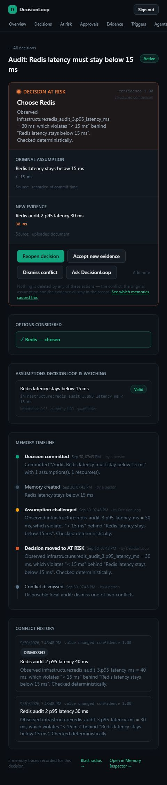
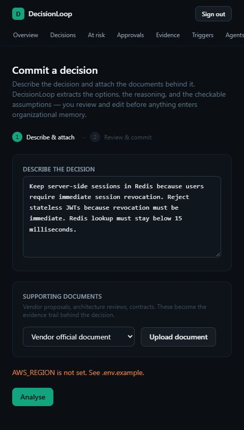

# DecisionLoop readiness audit — 30 September 2026

> Historical audit of the checkout before repairs. See [the remediation and UI rebuild report](2026-09-30-remediation.md) for the subsequent fixes and verification. The findings below preserve the original evidence.

DecisionLoop is worth including in an engineering portfolio as a working alpha. The headless decision engine is usable locally and has substantial automated coverage. The current checkout is **not ready for an unattended public demo or a production launch**. Its browser and deployment paths need targeted repairs; a wholesale rewrite is not justified by this review.

## Scope and evidence boundary

Reviewed the root configuration and deployment files, CLI/runtime, authentication, HTTP/MCP/SDK wiring, SQL migrations and storage, provider selection, decision/evidence/approval services, legacy web routes, main browser screens, tests and evaluation setup. Exercised the current working tree on branch `decisionloop-2.0`, HEAD `8e8aa81`, using Node 22.13.0 on Windows. Existing changes were preserved. This is a readiness review, not a complete security or line-by-line audit.

The checkout already contained 21 modified tracked files plus two new verification migrations and a new GitHub test. Consequently, a successful check here includes work that is not yet committed. No fetch, push, merge, live migration, paid model call or cloud deployment was performed. Remote default-branch content and live infrastructure remain unverified.

Tests used disposable embedded PostgreSQL/PGlite databases and explicit offline providers. Browser tests used synthetic accounts in the disposable local database. No real credentials were requested or printed. Review artifacts are the only intentional additions to tracked source directories.

## What passed

| Check | Result | Practical meaning |
|---|---|---|
| `npm run typecheck` | Pass | Current TypeScript code compiles |
| `npm run lint` | Pass | Current lint rules pass |
| `npm run build` | Pass | Next.js production compilation completes without database/cloud credentials |
| `npm test` | 24 files passed; 214 tests passed; 1 skipped | Unit and database integration coverage ran with embedded PostgreSQL |
| `npm run eval` | All 24 dataset cases passed | Offline lexical retrieval and scripted semantic judgments pass this dataset |
| `npm ci --dry-run --ignore-scripts` | Pass | Manifest/lockfile consistency check, not a fresh installed-environment proof |
| CLI `init`, `serve --web`, `doctor` | Pass after a web build | Embedded workspace, credentials, API and worker start; MCP exposes 13 agent tools |
| Browser signup | Pass | A new workspace/account and authenticated session can be created locally |
| Independent HTTP smoke story | Pass | Human commits; agent retrieves; agent commit returns 403; contradictory evidence becomes `AT_RISK`; a review opens; replay creates no duplicate event |
| Full server restart followed by CLI `show` | Pass | The independently created decision and its `AT_RISK` status survive restart on disk |

The single skipped test is the no-database fallback case in `crossSessionMemory.test.ts`; global setup supplied a database. The deployed Playwright suite was not run because no deployment URL or real model/storage configuration was available.

The refreshed evaluation measured retrieval recall 1.00, retrieval precision 0.89, governing decision ranked first 1.00, conflict precision/recall 1.00, zero tenant leaks, and 117 average context tokens. Its semantic provider is a scripted stand-in. Those figures do not establish live model quality, real-world usefulness or production latency. See the generated, ignored `evals/reports/latest.md`.

HTTP receipts: [core story](evidence/2026-09-30-http-smoke.json), [browser-route conflict reproduction](evidence/2026-09-30-web-conflict.json).

## Release-blocking findings

### 1. Browser dismissal can incorrectly restore an unsafe decision — high priority, reproduced

`app/api/conflicts/[id]/resolve/route.ts` calls the legacy `lib/engine/decisionActions.ts`. Its `dismissConflict` unconditionally restores the shared assumption to `VALID`, then checks assumption flags rather than remaining conflicts.

Reproduction through the running web server:

1. Commit a decision with one numeric assumption: Redis p95 latency must remain below 15 ms. Give the assumption authority 1.0.
2. Submit two human observations, 30 ms and 40 ms, through `/api/v1/evidence`. Both challenge the same assumption and create separate conflicts.
3. Dismiss one conflict through `/api/conflicts/<id>/resolve`, the browser's route.
4. The decision changes from `AT_RISK` to `ACTIVE`; the assumption becomes `VALID`; one conflict remains unresolved.

The detail page simultaneously shows **Active** and **DECISION AT RISK**. The newer `packages/core/src/services/approvals.ts` implementation checks remaining conflicts and already accepted invalidations, and closes associated review approvals transactionally. The legacy route bypasses those protections.

Fix by routing browser mutations through the shared core operations and add an actual route/browser regression for multiple conflicts on one assumption. Cover accepted evidence followed by dismissal, approval closure and supersession as well. Migrating only the visual labels will not fix the stored state.

### 2. The first-decision browser workflow contradicts the offline/provider promises — high priority, reproduced

In offline local mode, signup works but `/decisions/new` requires **Analyse** before review and commit. `/api/decisions/extract` calls `lib/ai/extraction.ts`, which still uses the legacy Bedrock-only `getReasoningProvider()` in `lib/ai/bedrock.ts`.

Clicking Analyse produced `AWS_REGION is not set. See .env.example.` even with `DECISIONLOOP_REASONING_PROVIDER=none`. Selecting the newer OpenAI-compatible provider also does not reroute this legacy extraction path. The CLI/API can record structured decisions without a model, but an ordinary browser user cannot complete their first decision in the advertised no-cloud setup.

Provide a manual structured creation path, route supported model calls through one provider-selection layer, and explain unavailable model features in the UI before the user submits. The UI also lacks controls for the newer resource bindings, typed boolean/date/version/set assumptions, executable constraints and workflow checks; these currently require CLI/API use.

### 3. Installed production dependencies include critical advisories — high priority, live registry check

`npm audit` reports 10 affected packages across all dependencies: 1 critical, 4 high and 5 moderate. `npm audit --omit=dev` reports 6: 1 critical, 2 high and 3 moderate. These are package-advisory counts, not proof that every advisory is exploitable through this app.

The installed/locked Next.js version is 16.3.1. The reviewed [Windows-hosted RCE advisory](https://github.com/advisories/GHSA-p293-qw3h-jr36) affects this range and lists 16.3.3 as patched. The separate [AVIF image-optimization advisory](https://github.com/advisories/GHSA-2xp9-vwfh-vxw4) also lists 16.3.3 as patched. The Windows finding is directly relevant to exposing this development machine as a public server. AVIF exploitability depends on use of the affected image path; that was not demonstrated here.

Update Next.js and its matching ESLint package to a maintained patched version, update the affected transitive dependencies, commit the lockfile, and rerun build/tests. Do not treat `npm audit fix --force` as a substitute for a reviewed update. The production audit also names sharp and fast-uri as high severity, and hono, ip-address and qs as moderate.

### 4. The documented primary hosting target is not validated for this Next.js release — high priority

`docs/deployment.md` recommends AWS Amplify; the project runs Next.js 16.3.1. Current [AWS support documentation](https://docs.aws.amazon.com/amplify/latest/userguide/ssr-amplify-support.html) documents support through Next.js 15. This does not prove every possible custom deployment fails, but it does mean the repository's standard Amplify claim is unsupported by the documented compatibility matrix.

The current `amplify.yml` also never arranges SSR runtime configuration. [AWS documents](https://docs.aws.amazon.com/amplify/latest/userguide/ssr-environment-variables.html) that build-console environment variables are not automatically available to Next.js server components. This app reads database and signing settings lazily at runtime. Successful build-time migrations therefore do not establish usable runtime authentication/database access. Secret delivery and an SSR compute role need an explicit verified design; a build service role alone is not runtime proof.

Choose and validate one supported hosting path with the selected framework version. For this architecture, an external PostgreSQL/CockroachDB database plus a persistent web service and separately supervised worker is a coherent deployment topology. Its actual host/runtime compatibility must still be tested.

### 5. Hosted evidence processing has no deployed worker — high priority, configuration inspection

`lib/decisionloop.ts` explicitly says the Next.js web process does not run the worker. CLI `serve` does run it, but both `next start` and the Docker standalone `server.js` run only the web app. Neither `amplify.yml` nor `Dockerfile` provisions the separate `decisionloop worker` service.

API-submitted evidence and GitHub webhooks enqueue work. With just the documented hosted web deployment, those jobs will remain queued; expiry work and retry jobs also need a worker. Some document processing runs inline, which does not fix the general queued-evidence path.

The standalone Docker image also does not explicitly ship the CLI launcher, TypeScript runner and migrations required by the documented worker command. Make the worker a real deployable artifact/service, with restart policy, provider/DB settings and queue monitoring. Verify a webhook reaches `PROCESSED` and creates the correct warning on the deployed stack.

### 6. The Docker fallback references a missing build artifact — high priority, file inspection

`Dockerfile:31` copies `/app/public` from the builder. The repository contains no `public/` directory or tracked files under it. The builder never creates it, so that COPY has no source in a clean build.

Remove the unnecessary copy or supply the directory during build. Broaden `.dockerignore` to exclude local `.decisionloop` data and all secret environment-file variants; it currently excludes only `.env` and `.env.local`. Docker is unavailable on this machine, so no image build/run was claimed. A normal Next.js build is not a container validation.

## Setup and product-quality changes

| Gap | Evidence | Required improvement |
|---|---|---|
| Fresh-clone quick start omits the web build | README calls `serve --web`; runtime defaults `dev` to false; `.next` is untracked | Include `npm run build`, or explicitly use `serve --web --dev` for local development |
| Blank provider settings fail | `.env.example:72-73` defines empty values; provider selectors use `??`, not blank-value normalization | Set explicit defaults or treat blank settings as unset. Reproduced `Unknown ... PROVIDER ""` for both selectors |
| Migration/seed scripts do not load the advertised `.env.local` by default | `db/migrate.ts`, `db/seed.ts` and verification/reset scripts import `dotenv/config`, which defaults to `.env` | Use consistent Next-compatible env loading or document/export the exact required configuration path |
| Local user-creation sequence is misleading | Getting-started creates the web user after starting the embedded server; user creation opens another runtime on the same on-disk DB | Create the user before starting `serve`, or expose an authenticated setup operation through the running server |
| Browser and CLI signup can create separate workspaces | CLI init creates one tenant; browser signup creates another | Offer a clear same-workspace sign-in/setup flow rather than making the user accidentally create a second workspace |
| Public login/signup and expensive legacy routes lack abuse limits | Auth routes have no limiter; versioned API limiter runs after authentication and is per process | Add shared/edge login and signup limits, plus per-tenant model/upload quotas before opening anonymous registration |
| No CI workflow is checked in | No `.github/` directory | Add install, typecheck, lint, tests, evaluation and deployment-artifact checks on PRs |
| Deployment docs mix 1.x and 2.0 setup | They still say integration tests need a hosted DB and skip without one; current global setup runs embedded tests | Rewrite around one validated local path and one validated hosted path |
| Operational health does not establish processing health | `/api/health` checks SQL connectivity; versioned health does a limited job read | Add worker heartbeat/queue lag/dead-letter visibility and use end-to-end smoke checks as the release gate |

Authentication already uses hashed passwords, httpOnly cookies, server-side session revocation and tenant-scoped reads; agent tools/scopes enforce human approval boundaries in the tested core. Preserve those strengths while adding abuse controls. Enterprise SSO, MFA and database RLS are later hardening decisions; they are not prerequisites for a carefully limited portfolio demo.

## Portfolio assessment

The strongest portfolio story is **persistent, assumption-aware decision memory for coding agents**. The project demonstrates more engineering depth than a thin chat interface: typed evaluations, structural retrieval, conservative authority rules, human approval, durable work, tenant isolation, API/MCP/SDK/CLI surfaces and inspectable provenance.

Use a focused demonstration: record a Redis-session decision and rejected JWT alternative; retrieve it from a fresh agent session; submit a changed security requirement; show the at-risk warning, its evidence, and human review. Include architecture and a short explanation of why deterministic checks precede model judgments. State plainly which parts run offline and which require a configured model.

Present it now as an **alpha engineering project** or case study. Before sending recruiters a self-serve demo URL, fix the first-decision workflow and conflicting-status bug, patch dependencies, validate the hosting/worker setup, seed a guided example and verify it from a fresh browser. Do not describe it as production-proven or quote the scripted dataset as real model accuracy.

Real usefulness still needs dogfooding in one repository over multiple sessions: whether agents request context, whether warnings arrive at useful times, whether people accept reviews, and whether decisions remain current. The existing dogfood plan is a good starting point; the test suite cannot supply those adoption results.

## Suggested repair order and release gate

1. Patch dependencies; route browser conflict actions through the shared core; add the reproduced route regression.
2. Fix first-run configuration and add model-free/manual browser creation; use one provider selection layer.
3. Fix container packaging and ship the worker; select a supported hosting path and runtime secret delivery.
4. Add CI and test a completely fresh installation. Commit the existing verification work only after review so it is actually available from the repository.
5. Deploy a restricted validation environment. Prove authentication, decision creation, fresh-session retrieval, evidence processing, approval resolution, persistence after restart and GitHub workflow receipts against a real App installation.
6. Add a guided demo and case study, then dogfood before making broader reliability claims.

No live CockroachDB migration, Bedrock/OpenAI judgment, S3 upload, real GitHub App delivery, Docker image or cloud deployment was verified in this review. The local core passes; public deployment readiness remains blocked by the concrete issues above.
