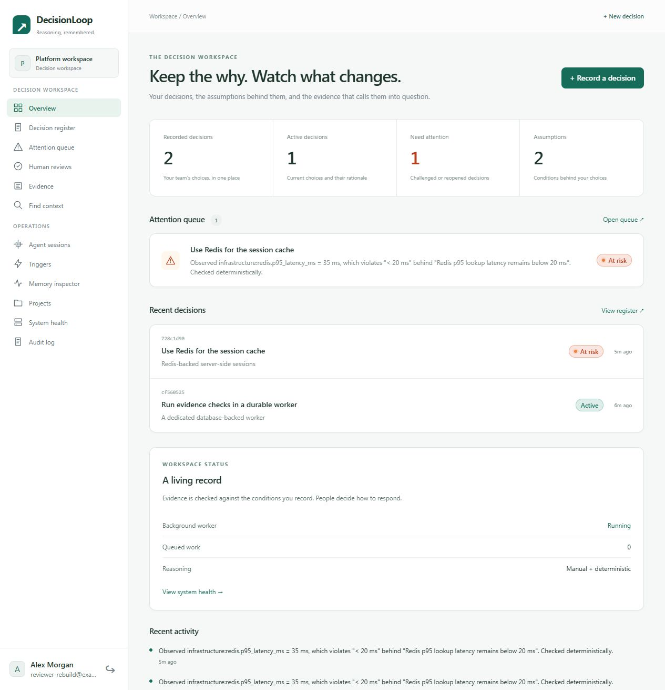

# DecisionLoop repairs and UI rebuild — 30 September 2026

DecisionLoop now has a usable model-free browser workflow and a rebuilt control plane. The local production entry point passes an end-to-end smoke check, including a process restart. It is suitable for a portfolio demonstration as a tested alpha. A public deployment still needs container execution and fresh proof of the integrations it enables.

## What changed

| Original issue | Implemented repair |
|---|---|
| A first decision required Bedrock | Manual decision entry with rationale, alternatives, typed conditions, resources and optional human-configured GitHub workflow checks |
| Dismissing one conflict cleared another | Browser actions use the shared core; regression coverage reproduces two conflicts on one assumption and verifies the remaining warning |
| Empty provider settings broke defaults | Blank selectors, model names and endpoint settings fall back consistently; browser AI routes use the selected provider |
| Unconfigured assistance produced internal errors | Model-dependent routes return an actionable 503; document upload is unavailable until storage and a reasoning model are configured |
| Browser account created a separate local workspace | First local account joins the initialized CLI workspace; concurrent bootstrap creates only one owner |
| No durable abuse budgets or closed production signup | Database-backed authentication, API and model/upload budgets; hosted registration closed unless explicitly enabled |
| CLI/scripts missed local environment files | Shared environment loader with process environment precedence |
| Web deployment omitted a worker | Production server runs the worker by default; Compose explicitly separates web and worker with migrations before startup |
| Broken Docker packaging and secret/data exclusions | Full application runtime image, no missing public-directory copy, local data and environment variants excluded |
| Old framework vulnerabilities | Next.js 16.3.7 and updated dependency lockfile; npm audit reports zero vulnerabilities |
| No CI | GitHub Actions runs typecheck, lint, tests, evaluations, build, production smoke and dependency audit; separate image-build job |
| Health did not show background execution | Persisted worker heartbeat, queue state and oldest queued work in System health |

The production start command requires an external database and a session secret. Migration 0010 adds the shared request budgets and worker heartbeats. Existing workflow-verification changes and migrations 0008/0009 were preserved.

## UI and interaction design

Rebuilt the landing and authentication screens, shared navigation and visual system, overview, searchable decision register, manual entry, decision detail and review, attention queue, evidence submission, context retrieval, projects and system status. The remaining operational screens use the same shell, typography, controls, headers and status treatment while retaining their existing workflows.

The interface uses a restrained light workspace, green actions, readable records and a persistent grouped sidebar. It includes loading, empty and error states, retry actions, keyboard focus, a skip link, reduced-motion handling and mobile navigation. Closed mobile navigation is hidden from the accessibility tree; Escape closes it. Mobile overflow was checked at a 390 × 844 viewport override and the measured document width equaled its client width.

The local preview contains synthetic demonstration data. Browser interactions created a Redis session-cache decision, submitted a measured contradiction, dismissed an earlier nonrepresentative measurement with a review note, retrieved context by governed resources, then submitted a new representative contradiction. The final overview shows the real resulting at-risk record. A second decision with a Boolean condition was committed through the final form.



Additional screenshots: [decision detail](evidence/2026-09-30-rebuild-decision.png), [mobile overview](evidence/2026-09-30-rebuild-mobile.png).

## Verification

| Check | Result |
|---|---|
| TypeScript and ESLint | Passed |
| Unit and SQL integration suite | 26 files passed; 220 tests passed; 1 skipped |
| Offline evaluations | All 24 dataset cases passed |
| Production build | Passed, Next.js 16.3.7 |
| Dependency audit | Zero reported vulnerabilities |
| Manifest/lock consistency | `npm ci --dry-run --ignore-scripts` passed; this is not a fresh reinstall |
| Browser walkthrough | Model-free decision entry, typed evidence, processing, review and context retrieval passed |
| Responsive checks | Menu open/close, hidden closed navigation, Escape and no horizontal overflow passed |
| Browser console | No warning/error entries in the final walkthrough |
| Production entry point | Authentication, typed evidence, worker heartbeat, multi-conflict dismissal, context retrieval, persistence after restart and closed hosted registration passed |

The production smoke script builds an isolated embedded PostgreSQL server exposed over TCP, then launches the actual production server against that SQL URL. It uses no reasoning model and lexical embeddings, and never connects to the configured application database. It also verifies model-dependent extraction returns 503. The sanitized [production receipt](evidence/2026-09-30-production-smoke.json) records the outcome. This is process and persistence evidence, not proof of managed PostgreSQL or CockroachDB deployment.

## Run and deploy

Follow [the deployment guide](../deployment.md) for fresh local installation and the container topology. A fresh local browser setup is:

```powershell
npm ci
npm run build
npm link
# In the repository whose decisions you want to record:
decisionloop init
decisionloop serve --web
# Open http://127.0.0.1:4318/signup for the first local owner.
```

`npm run verify:deployment` repeats the isolated production story after a build. It keeps its disposable artifacts under the ignored `.scratch` directory for diagnosis.

## Remaining evidence and product work

Docker is unavailable on this machine. The image and Compose topology were inspected, but image build and container execution must pass on a Docker host. The new GitHub workflow has not run remotely because these changes have not been published.

Real model access, S3 upload, a GitHub App installation and workflow delivery, managed-database migrations, TLS hosting, backups and restore remain unverified. Enable only the integrations you plan to demonstrate and verify their full workflow in the target environment. Worker heartbeat or health alone cannot substitute for that proof.

The project remains an alpha. Lexical retrieval is offline vocabulary matching; the scripted evaluation dataset is not live model accuracy. Dogfooding across multiple coding sessions, monitoring failed jobs and pagination beyond the current bounded workspace listing are follow-up product work before broad production claims.

This repair report records the local checks before publication on `decisionloop-2.0`. Subsequent publication adds the product README and editable Remotion demo; consult Git history for the published revision. No cloud migration or deployment was performed. Existing unrelated changes were preserved.
